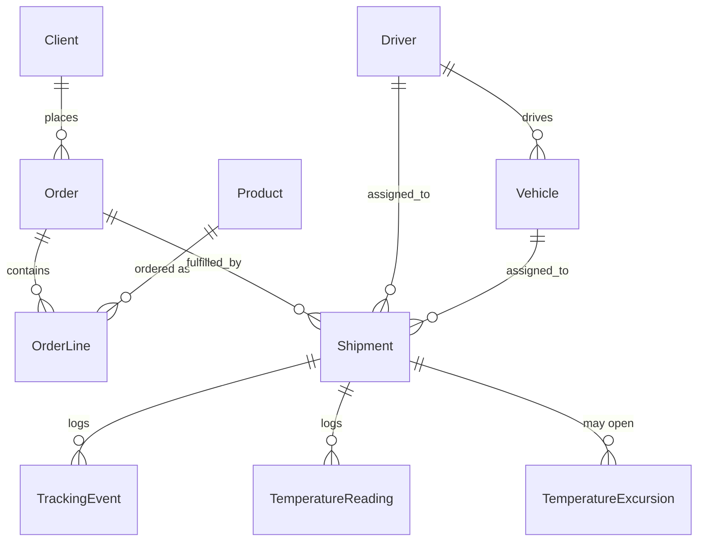

# ColdChain

A logistics platform for temperature-controlled freight. It covers order intake,
shipment tracking from on-vehicle devices, integrations with external partner
systems, and the cold-chain compliance record that pharmaceutical distribution
(GDP) requires.

This is a personal project. It is built to be read, so the interesting parts are
the domain rules and the integration boundaries rather than the CRUD around them.

Work in progress. See `docs/decisions/` for the reasoning behind the structural
choices.

## Domain

Code is organised by bounded context under `app/Domain`, not by technical layer:
`Ordering`, `Shipping`, `ColdChain`, `Auditing`. Each has its own models, enums
and value objects; a shipment's status, for instance, is a `ShipmentStatus` enum
that guards its own transitions rather than a string anyone can set.



`TrackingEvent`, `TemperatureReading` and `AuditEntry` are append-only: no
update route exists or ever will for them. A shipment's position and status
are projections over its tracking events, not fields mutated directly.
`TemperatureExcursion` is the one mutable record in ColdChain — it is opened
as a candidate and updated as it is confirmed or resolved.

`POST /api/v1/shipments/{id}/telemetry` is how a device reports position
(and, optionally, temperature). It's idempotent — a retried ping with the
same `external_event_id` is a no-op, not a duplicate row — and responds
`202` immediately; updating the shipment's position, advancing its status,
and writing the audit entry all happen in queued listeners reacting to a
`TelemetryRecorded` event, off the request.

## API

`/api/v1` is a token-authenticated REST API (Sanctum). `POST /api/v1/login`
exchanges credentials for a token; every other endpoint requires it as a
Bearer token and is scoped by the caller's role:

- **planner** — full access to everything.
- **driver** — can only see shipments (and the vehicle) assigned to them.
- **client** — can only see their own orders and the shipments on them.

Policies (`app/Policies`) gate access to a single record; list endpoints
additionally scope their query by role in the controller, since a policy
can authorize "can this user view *this* shipment" but has no say over
which rows a listing query returns in the first place.

## Client order webhook

`POST /api/v1/webhooks/client-orders/{partner}` is how partner systems place
orders directly, instead of going through the dashboard. It's outside
`auth:sanctum` — a partner isn't a user — and authenticated instead by an
`X-Signature` header: HMAC-SHA256 of the raw request body under a secret
shared with that partner (`config/client_order_partners.php`).

Two partners are configured, `acme-coldchain` and `northstar-freight`, each
with its own payload shape (snake_case/ISO-8601/kilograms vs.
camelCase/`dd-MM-yyyy`/pounds) and its own `ClientOrderAdapter`
(`app/Integrations/ClientOrders/Adapters`) that normalizes it into the same
shape before anything domain-specific happens. A partner's own product code
is resolved to our SKU through `partner_product_mappings`; an order the
partner has already sent (matched by `{partner, external_reference}`) is a
no-op, not a duplicate — the same idempotency shape as device telemetry
(ADR 0005), for the same reason: partners retry webhooks they can't confirm
were received.

Every inbound payload — including ones that fail — is kept in
`integration_messages`, so a rejected order can be diagnosed and reprocessed
without asking the partner to resend it.

## Demo: simulating a fleet

```
php artisan db:seed
php artisan fleet:simulate --vehicles=5 --ticks=10 --packet-loss=10 --duplicate-rate=15
```

`fleet:simulate` sends real HTTP requests to the running API — the same
`/telemetry` endpoint a real device would call — for whichever shipments are
currently picked up or in transit, so it needs the stack to actually be up
and reachable at `APP_URL` (run it from the host, not from inside the `app`
container). `--packet-loss` drops a percentage of pings before they're ever
sent; `--duplicate-rate` resends the previous ping unchanged, to make the
idempotency handling visible rather than theoretical.

## Stack

- PHP 8.4, Laravel 13
- PostgreSQL 17, Redis 7
- Docker Compose for the local environment
- PHPUnit, Pint, Larastan (level 6)

## Running it locally

```
cp .env.example .env
composer install
docker compose up -d
php artisan key:generate
php artisan migrate
```

The application is served at http://localhost:8100.

Postgres and Redis are published on 55432 and 56379 so the stack does not
collide with anything already running on the default ports. `.env` points at
those, which means `artisan` and `phpunit` work from the host; inside the
Compose network the `app` service overrides the host and port with the service
names.

## Tests

```
php artisan test
```

Tests run against a real `coldchain_testing` database, created by
`docker/postgres/init/01-test-database.sh` when the Postgres volume is first
initialised. If you already have a volume from before that script existed, run
`docker compose down -v` once to recreate it.

## Checks

```
vendor/bin/pint --test
vendor/bin/phpstan analyse
```
